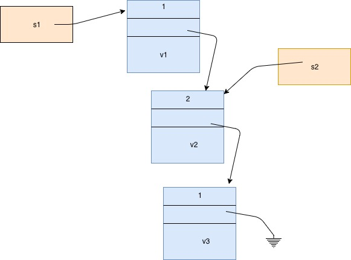

Slist Design
============

An slist is a purely functional, abstractly immutable, singly linked list.
A smart pointer is used to maintain the abstraction over a list
of reference counted list nodes.

Dynamic uniqueness detection is used
to optimise list operations by internally modifying lists
when a function has exclusive ownership.

Slist has a strong property that a read iterator cannot be invalidated
and always refers to the sequence of elements in the list at the time
of the iterators construction.

